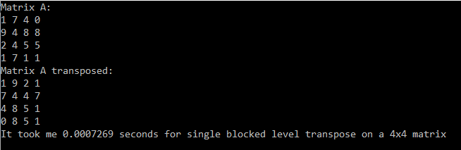
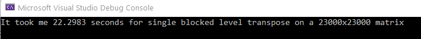

# Matrix-Transpose

This is one of the assignments for Computational Problem Solving for Engineers

* The goal is to employ [openmp](https://www.openmp.org/) for parallel processing to transpose a huge square matrix in C++

* To accomplish this, I implemented the transposition of a matrix by partitioning it into smaller blocks and utilized openmp to perform the transpositon of smaller blocks in parallel.

[Source.cpp](Source.cpp) contains all my code for the task, and it can transpose a 2300x2300 matrix around 27 secounds.

> I executed it using the openmp supported in Visual Studio 2019
> The matrix is generated by filling with random digits

[openmp_hw5.exe](openmp_hw5.exe) is the executable file for transposing a random 2300x2300 matrix

## Demonstrate
Below is the demonstration for the correctness of my matrix transpose implementation

  

Below is the demonstration for the result of transposing a 2300x2300 matrix

  

